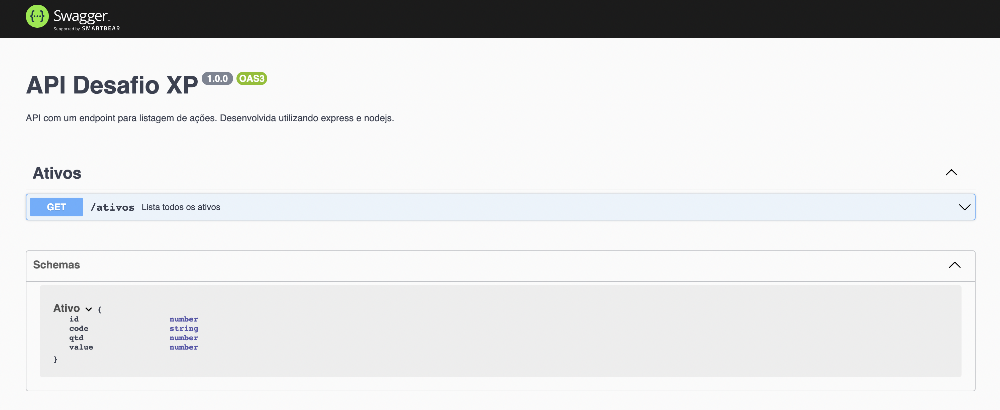

# Desafio Back-end - Processo seletivo XP

## Sobre o projeto

Neste projeto desenvolvi uma API simples para a listagem de ações. Foi utilizada a arquitetura MSC (Model, Controller e Service).

<p align="center">
  
</p>

## Tecnologias utilizadas

- [TypeScript](https://www.typescriptlang.org/)
- [Node.js](https://nodejs.org/en/)
- [Express](https://expressjs.com/pt-br/)
- [MySQL](https://www.mysql.com/)
- [Swagger](https://swagger.io/)

## Documentação

A documentação da API foi feita com Swagger e pode ser acessada aqui: [link documentação](https://xp-api-mariane.herokuapp.com/docs)

## Front-end

A utilização da API pode ser vista no projeto desenvolvido para o Front-end:

- [Deploy](https://psel-xp-front-end-mariane.vercel.app/)

- [Repositório](https://github.com/MarianeAlgayer/psel-xp-back-end)

## Como baixar e executar o projeto

- Clonar o repositório:

```
    git clone git@github.com:MarianeAlgayer/psel-xp-back-end.git
```

- Entrar no diretório do projeto:

```
    cd psel-xp-back-end/back-end
```

- Instalar as dependências:

```
    npm install
```

- Criar o banco de dados utilizando os comandos do arquivo **xp-api.sql**.

- Renomear arquivo **.env.example** na raiz do projeto para **.env** e configurar as variáveis de ambiente.

- Executar o projeto:

```
    npm run dev
```

<p align="right"><a href="#top">Voltar ao topo</a></p>